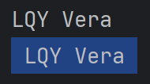
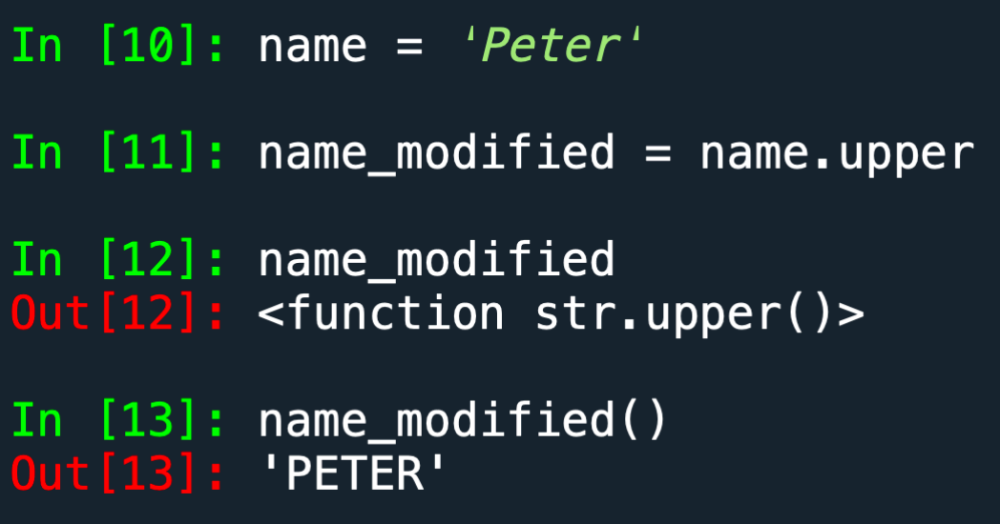
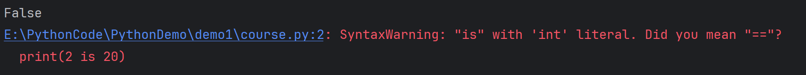
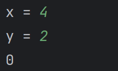

## SMA-w2_1

### Variables(变量)

```python
message="Hello World!"
```

变量的名字可以用数字，字母或者下划线，但是不能用数字进行开头。同时不能用Python的关键词或者函数(keywords or functions)

### 输出语句

```python
print("Hello World")
```

If you need to use variables in strings,  

you  could use f-strings (f means format)

```python
a = "LQY"
b = "Vera"
print(f"Hello {a} {b}")

# Hello LQY Vera
```

### Tabs and Newlines

You can use `\t` or `\n` to improve the format of  the print output

```py
print("\tHello")

#	Hello
# \t 其实代表是制表键tab，
#缩进代码块：在Python中，缩进是表示代码块的方式之一，制表键通常用于缩进代码，以指示代码的层次结构。例如，在if语句、for循环、函数定义等情况下，缩进的代码块表示在特定条件下执行的代码。Python约定使用4个空格作为一级缩进，但通常可以使用制表键（Tab键）来代替。
```

```py
print("\nVera")
#
#Vera

# \n 代表换行，可以使输出更加美观
```

### Remove whitespace

Remove extra whitespace (temporarily) in  strings: `rstrip()`,` lstrip()`, `strip()`

```py
name = ' LQY Vera '
print(name.strip())
print(name)
```



根据运行结果可以发现，运行strip()，并不会直接将原始变量的前后空格去除，而只是临时去除，第二次输出变量的时候，前后空格依然存在，所以只有将去除空格后的变量去赋值，才可以保存变量

```python
name = ' LQY Vera '
name = name.strip()
print(name)

#LQY Vera
```

### Numbers

Integers 类型，最基础的整数

与数字类型相关的运算符，`+, -, *, /, **`，`** `代表平方，例如`3 ** 2`的结果是9。（在操作符前后加上空格可以提高代码的可读性）

多重赋值：Multiple assignment: `x, y, z = 1, 2, 3` 。在python中，你可以利用多重赋值来减少代码的行数，这一句代码的意思是给x赋值为1，y赋值为2，z赋值为3。

Numbers with a decimal point is called a  float (eg, 3.0).

带了小数点的数字，被称为浮点数（3.0），也就是小数

计算机在内存中以一种特定的方式存储数字，它们通常必须将某些数字（如π）四舍五入为接近但不完全相等的值。因为计算机内部是使用二进制存储，表达的数字范围有限，一般很长的小数都无法表达出完全相等的值。

### Str() function

此函数可以帮助你让不同类型的数据能够兼容

`str()`可以将数字转换为字符串

当你想同时将数字类型和字符串类型赋值给一个变量的时候，python会报错

```python
age = 3
message = "you are"+" "+age+" "+"old"
# 上段代码会报错，原因是同时将数字类型和字符类型赋值给同一个变量message
```

```python
age = 3
message = "you are"+" "+str(age)+" "+"old"
# 修改成这样就不会报错，因为使用str()函数将数字类型转换成字符类型
```

### Q & A

- Q: What does the empty parentheses at the  end of a method do?  
- 问：方法末尾的空括号有什么作用？
  - A: When you define a function, you need to  allow it to receive parameters (we will talk  about it later in the course), and you will use  parentheses for that purpose. Methods are  similar to functions and follow that tradition,  but for a different reason. Without them, the  method wouldn’t actually be called (see  examples in next slide). 
  - 答：当你定义一个函数时，你需要允许它接收参数（我们将在课程后面讨论这个），你将使用括号来实现这个目的。方法类似于函数，并遵循这一传统，但出于不同的原因。如果没有它们，方法实际上不会被调用（请参阅下一张幻灯片中的示例）。



- Q: What is the difference in calling a function  and calling a method

- 问：调用函数和调用方法有什么区别？

  - Functions are not associated with any  object, and they operate on the data you  pass to them as arguments. eg. str(age) in  the previous example about str() function; 

  - 函数不与任何对象关联，它们操作你传递给它们的数据作为参数。例如，在关于 str() 函数的前面示例中的 str(age)； 

  - Methods are associated with the objects. eg.  name.title() 

  - 方法与对象关联。例如，name.title()； 

  - Did you notice that the order is different? 

    

### Bool

● Boolean data have two values: True, False   

● For numbers, Bool() function returns False  for zero values and True for non-zero values   

● For strings, Bool() returns False for empty  strings and True for non-empty strings  

● This might be useful when your programme  has to make selections in coding 

● You can use type() function to check the data  type


布尔值 

● 布尔数据有两个值：True（真）和False（假） 

● 对于数字，Bool() 函数返回零值为False，非零值为True 

● 对于字符串，Bool() 返回空字符串为False，非空字符串为True 

● 在编程中，这可能会在程序需要进行选择时很有用 

● 你可以使用 type() 函数来检查数据类型


### Common operators

● arithmetic: % (return remainder), // (return  integral result)  

● relational: ==, !=, <, >, <=, >= 

● logical: and, or, not 

● membership: in, not in 

● identity: is, is not (try 2 is 20 and see what  python will return) (similar to ==, but is  check if two variables pointing to the same  object

### 常见的运算符
● 算术运算符：%(返回余数), //(返回整数结果)
● 关系运算符：==, !=, <, >, <=, >=
● 逻辑运算符：and, or, not
● 成员运算符：in, not in
● 身份运算符：is, is not（尝试 2 is 20，看看 Python 会返回什么）（类似于 ==，但 is 检查两个变量是否指向同一个对象）

```py
print(2 is 20)
```



"同一个对象"通常指的是内存中的同一块区域被多个变量引用。当你创建一个对象（例如一个整数、字符串、列表等），Python会为该对象分配一块内存，并将变量关联到该内存地址。如果两个变量引用的内存地址相同，则这两个变量指向的是同一个对象。

```py
X = 30
Y = X
```

在这里，`x`和`y`都指向内存中存储整数值42的同一块区域。因此，我们可以说`x`和`y`引用了同一个对象。


### Comments

● Use # to indicate the start of a comment, and  Python would ignore the line 

● You should use comments in your codes to  make them easier to understand

注释
● 使用 # 来表示注释的开始，Python 将忽略该行
● 你应该在你的代码中使用注释来使其更易于理解


### Input()

● The input() function pauses your program  and waits for the user to enter some text.  

● The input by the user will be assigned to a  variable. 

● Exercise: ask the user to input two integers,  then divide the first one by the second one,  and return the remainder. # you may need to  use function int()


**Input()**

● input() 函数会暂停你的程序，并等待用户输入一些文本。

● 用户输入的内容将被赋值给一个变量。

● 练习：要求用户输入两个整数，然后将第一个数除以第二个数，并返回余数。你可能需要使用 int() 函数。

```python
x = input("x = ")
x = int(x)
y = input("y = ")
y = int(y)
print(x%y)
# 为什么要int呢？
# 因为 input() 函数返回的是字符串而不是整数，所以需要将用户输入的字符串转换为整数
```



**Basic operations on strings** 

● Use + to combine two strings 

● Select one character of a string, use index  (starts from 0). 

● Use len() to find the length 

● Select part of the string, use index in the  format of [start: end: step] 

字符串的基本操作

● 使用 + 来连接两个字符串

● 选择字符串的一个字符，使用索引（从0开始）。

● 使用 len() 函数来找到字符串的长度

● 选择字符串的一部分，使用索引的格式[start: end: step]


### Algorithm

● An algorithm is a step-by-step procedure for  solving problems. 

● An algorithm shows the sequence of tasks.  Some tasks can be divided further into subtasks. 

● Sequence, iteration, selection are the  common elements in algorithm 

● Algorithms can be represented by flow  diagrams or pseudocode  

算法  

● 算法是解决问题的逐步过程。

● 算法显示任务的顺序。某些任务可以进一步分解为子任务。

● 顺序、迭代、选择是算法中常见的元素。

● 算法可以用流程图或伪代码表示。

